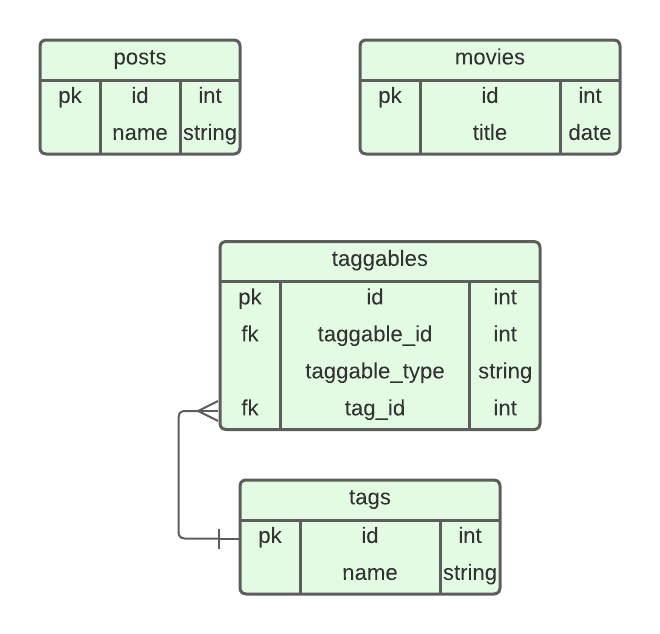

# Prueba

## Requerimientos:

- Laravel 8.*
- Php 8.*

## Pre-Instalacion Local

- Se debe agregar la base de datos junto con el user y password en el .env, si no existe haga copia del .env.example

## Instalacion Local

```console
unknown@unknown$ php artisan key:generate
unknown@unknown$ php artisan jwt:secret
unknown@unknown$ php artisan migrate:fresh --seed
unknown@unknown$ php artisan serve
```

## Pre-Instalacion Docker

- Instalar docker
- Instalar docker-compose
- Configurar puertos del servicio web y postgres. Se encuentra en el archivo docker-compose.yml

## Instalacion Docker

```console
unknown@unknown$ docker-compose up -d
unknown@unknown$ docker exec -d prueba php artisan migrate --seed
```

### Postman: 
- prueba.postman_collection.json (es el nombre del archivo se encuentra en la raiz del proyecto)

<br>
<br>

